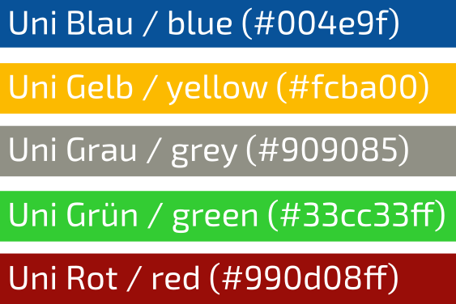

.. _nocv:

----------------------------
 ETS-NOCV
----------------------------

This chapter should serve as a quickstart tutorial guiding you through your first
calculation employing the xTB methods. 
As an example, the equilibrium geometry of a water molecule is calculated.
The description here is based on ``xtb`` version 6.2.2.

.. contents::

.. note:: The program can almost entirely controlled by the command-line, if you
          need more control you should resort to the :ref:`detailed-input` file.

There are four main run types in ``xtb``, most other run types are
composite types that try to provide convenient combinations from
those main run types.

Visualization
========================

