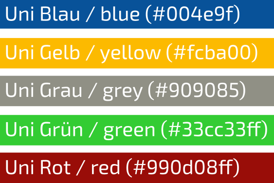

.. _plots:

----------------------------
 Plots
----------------------------

This chapter should provide some internal guidelines for plotting figures and data. 

.. contents::

Bonn Color Scheme
========================

The following color code was used in the context of publications of the University of Bonn, the red and green variants are no official colors but work well in combination with the other official colors.

Chimera commands
========================

Useful Chimera commands, that may be used to create nice and shiny figures of molecules.

.. code::

  transparency 70 sel
  set pseudobonds line width 5
  set silhouetteWidth 0.01
  bond sel

.. tabbed::
  .. code::
    from chimera import runCommand
    runCommand('preset apply pub 1')
    runCommand('represent bs')
    runCommand('setattr g color black')
    runCommand('color byelement')
    runCommand('setattr m stickScale 0.2')
    runCommand('setattr m ballScale 0.15')
    #runCommand('select Cu')
    #runCommand('vdwdefine +2.0 sel')
    #runCommand('color medium blue #1')
    #runCommand('match #0 #1')
    #runCommand('transparency 35 #1')

  
